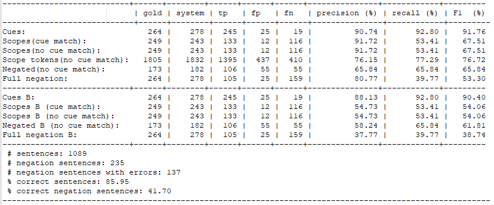
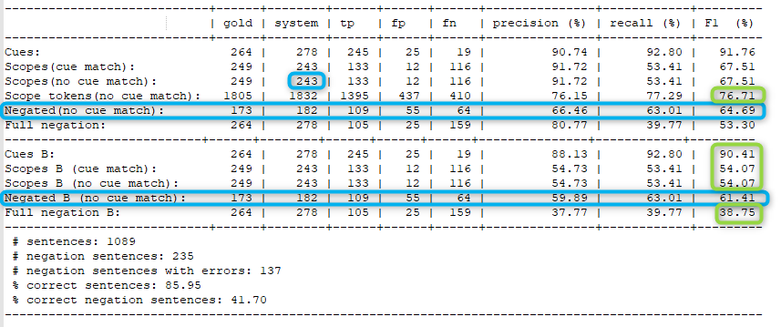
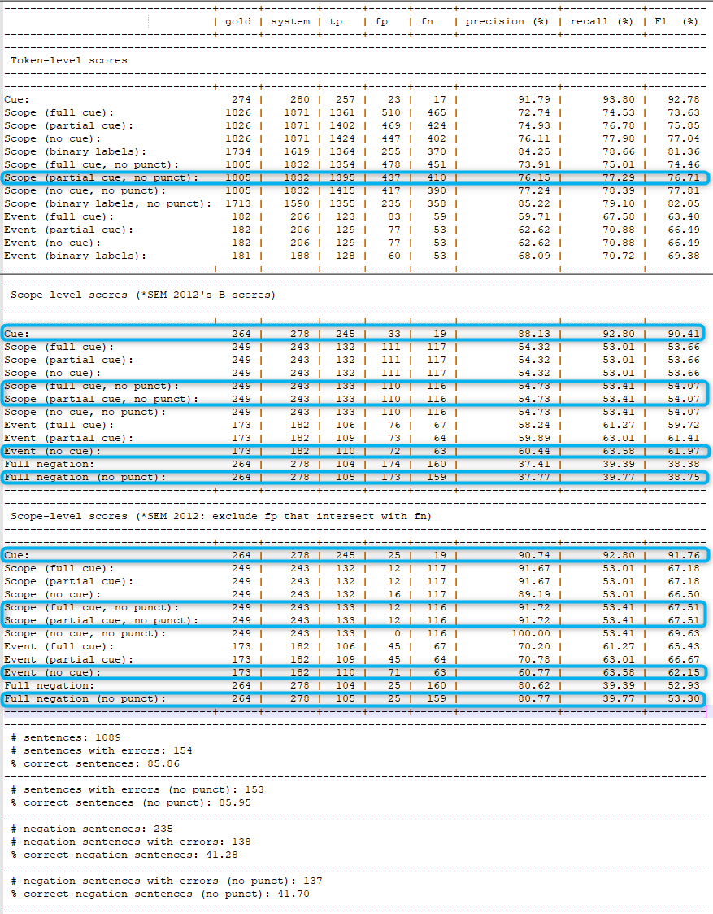
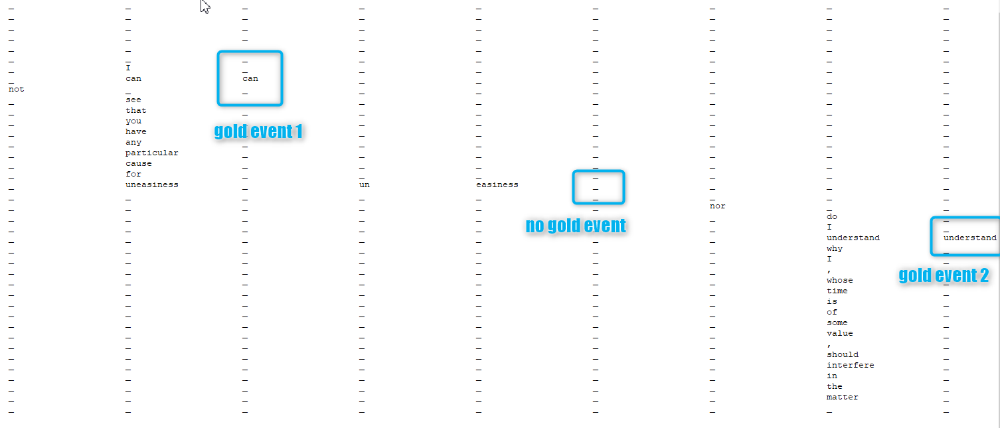
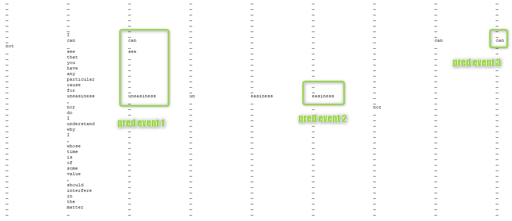

# *SEM2012 Evaluation Reproduction

This folder contains code of our reproduction/extension of the original *SEM2012 evaluation script.
	
## **Original**

For context, we here document the the original Perl evaluation script (`eval.cd-sco.pl`) as well,
which can be acquired at https://www.clips.uantwerpen.be/sem2012-st-neg/data.html.

The script outputs the following:

where:
* The upper part of the scores excludes FP that intersect with FN, i.e. any time there is a partial match between gold and pred, it is counted only as FN
* The lower part (B-scores) include the intersection and counts precision as TP/system (system = the number of predicted instances)
* Every score except for "Scope tokens" is calculated on _scope-level_, i.e. all parts of a cue / scope / event should be correct to get a TP
* Scopes (cue match) only allows a TP if the cue of the scope is fully correct as well
* Scopes (no cue match) and Scope tokens (no cue match) only allow a TP if there is at least a partial match with a cue, e.g. at least one word of a multi-word cue is predicted
* Negated (no cue match) is a score for events that compares events by checking if any elements of the gold and pred events overlap (without taking the cue into account completely), and counts a predicted event as TP if the prediction fully matches the gold (due to bugs, some of the FNs are counted incorrectly)
* Full negation needs every part of a whole instance (i.e. cue, scope and event) to be predicted correctly for a TP
* Punctuation is excluded from evaluation

**_Usage_**:

    [perl] eval.cd-sco.pl [OPTIONS] -g <gold standard> -s <system output>
 
    This script evaluates a system output with respect to a gold standard.
    The two files need to have the same number of lines.
 
    Optional parameters:
       -h : help:        print this help text and exit
       -r : readme:      print a brief explanation about the evaluation output

 
 

## **Translated**

[starsem2012_eval_translated.py](https://sourcecode.socialcoding.bosch.com/users/gst2rng/repos/neg_spec_resolution/browse/evaluation_scripts/starsem2012_eval_translated.py) - a Pythonized reproduction of the above script with some bug fixes:

\* circled are the parts that differ from the original:
	
* negated now counts FNs correctly
* TP for Scopes (no cue match) are now outputted correctly (not noticeable here as there all of the correctly predicted scopes had a full cue match)
* green is for results that differ by 0.01 due to different rounding

The script includes an option to output the exact same results as the original.

**_Usage_**:

	python starsem2012_eval_translated.py [-h] [-g GOLD] [-s SYSTEM] [-r] [-e]
		
	optional arguments:
		-h, --help                    show this help message and exit
		-g GOLD, --gold GOLD          gold standard file path (required)
		-s SYSTEM, --system SYSTEM    system output file path (required)
		-r, --readme                  print a brief explanation about the evaluation output
		-e, --starsem-exact           output the exact same results as the original (use -r
					        for a readme that includes a description of
					        differences between this evaluation script and the
					        original)

 
 

## **Extended**

[starsem2012_eval_extended.py](https://sourcecode.socialcoding.bosch.com/users/gst2rng/repos/neg_spec_resolution/browse/evaluation_scripts/starsem2012_eval_extended.py) - re-implementation of the original script that includes more scores:

\* circled are the parts that are present in original:
	
| **Original** | **Extended** |
| ------------ | ------------ |
| Cues | Scope-level scores (*SEM 2012: exclude fp that intersect with fn) --> Cue |
| Scopes (cue match) | Scope-level scores (*SEM 2012: exclude fp that intersect with fn) --> Scope (full cue, no punct) |
| Scopes (no cue match) | Scope-level scores (*SEM 2012: exclude fp that intersect with fn) --> Scope (partial cue, no punct) |
| Scope tokens (no cue match) | Token-level scores --> Scope (partial cue, no punct) |
| Negated (no cue match) | Scope-level scores (*SEM 2012: exclude fp that intersect with fn) --> Event (no cue) |
| Full negation | Scope-level scores (*SEM 2012: exclude fp that intersect with fn) --> Full negation (no punct) |
| Cues B | Scope-level scores (*SEM 2012's B-scores) --> Cue |
| Scopes B (cue match) | Scope-level scores (*SEM 2012's B-scores) --> Scope (full cue, no punct) |
| Scopes B (no cue match) | Scope-level scores (*SEM 2012's B-scores) --> Scope (partial cue, no punct) |
| Negated B (no cue match) | Scope-level scores (*SEM 2012's B-scores) --> Event (no cue) |
| Full negation B | Scope-level scores (*SEM 2012's B-scores) --> Full negation (no punct) |

Differences from the original:
- For B-scores, the _original_ still outputs FP as the number of FP that do not intersect with FN (since they count it as TP/system, they do not explicitly count the number of FP regardless of intersection and do not report it); _extended_ provides the actual FP used for the score
- The _original_ meant to process events the following way: for every gold instance, it would try to find an overlapping prediction [of events], and then would compare gold to the first found overlap; _extended_ checks if there are any <u>fully matching</u> gold and pred, and only if there are none would it look for an overlap. One case was found to be evaluated differently due to that:

Since the [fixed] _original_ looks for an overlap, it compares gold event 1 to pred event 1 and counts it as FN. Since the _extended_ script just checks for matches, it compares gold event 1 to pred event 3, and thus counts it as TP (and afterwards counts pred event 1 as FP). Since there isn't supposed to be any dependence on the cue, it stays it the way it is in _extended_, especially since there are two other metrics for events that do take the cue into account. The _original_ processes scopes and cues in a similar way (hence the original problem of multi-word cue predicted as several one-word cues); the _extended_ does the same for full and partial matches.

**Score summary**:
- For _token-level_, the score is measured for the tokens within each scope, i.e. one token can be counted several times if it belongs to more than one scope (same in the _original_)
- _binary labels_ is an exception from the above rule, it looks at each token separately from its cue and scope, and only evaluates the label it was given (e.g. if a token that was labeled as _scope_ in gold once and was predicted as _scope_ twice will be counted as a TP for _Scope (binary labels)_)
- For _scope-level_, every element of a given cue/scope/event should be correct to be counted as a TP
- _B-scores_ include all FPs when calculating precision, the original *SEM 2012 exclude FP-FN intersections from FP to avoid punishing the same mistake twice
- _no punct_ scores exclude punctuation completely (this was done for all of the scores in _original_)
- _full cue_ scores require full match with the cue, _partial cue_ require an overlap with the cue, _no cue_ are not dependent on the cue at all

**_Usage_**:

	python starsem2012_eval_extended.py [-h] [-g GOLD] [-s SYSTEM] [-r] [-t TASK]

	optional arguments:
		  -h, --help                    show this help message and exit
		  -g GOLD, --gold GOLD          gold standard file path (required)
		  -s SYSTEM, --system SYSTEM    system output file path (required)
		  -r, --readme                  print a brief explanation about the evaluation output
		  -t TASK, --task TASK          task to be evaluated (negation/speculation), default: negation
